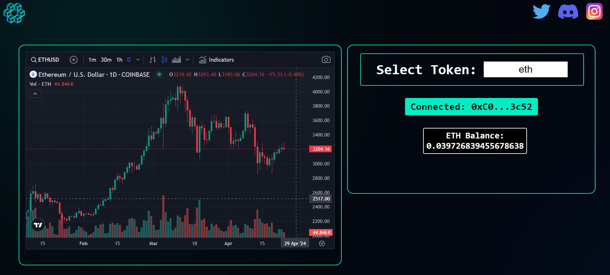

<!--
*** Do a search and replace for the following:
*** EvanGottschalk, AmmalgamOracle, EvanOnEarth_eth, evan.blockchain@gmail.com, simple UI for checking token prices and balances
-->

<!-- PROJECT SHIELDS -->
<!--
*** I'm using markdown "reference style" links for readability.
*** Reference links are enclosed in brackets [ ] instead of parentheses ( ).
*** See the bottom of this document for the declaration of the reference variables
*** for contributors-url, forks-url, etc. This is an optional, concise syntax you may use.
*** https://www.markdownguide.org/basic-syntax/#reference-style-links
-->
[![Contributors][contributors-shield]][contributors-url]
[![Forks][forks-shield]][forks-url]
[![Stargazers][stars-shield]][stars-url]
[![Issues][issues-shield]][issues-url]
[![MIT License][license-shield]][license-url]
[![LinkedIn][linkedin-shield]][linkedin-url]


<!-- PROJECT LOGO -->
<br />
<p align="center">
  <!--   <a href="https://github.com/EvanGottschalk/AmmalgamOracle">
    
  </a> -->
  <a href="https://github.com/EvanGottschalk/AmmalgamOracle">
    
  </a>

  <h3 align="center">AmmalgamOracle</h3>

  <p align="center">
    A simple UI for checking token prices and balances
    <br />
    <a href="https://github.com/EvanGottschalk/AmmalgamOracle"><strong>Explore the docs »</strong></a>
    <br />
    <br />
    <a href="https://github.com/EvanGottschalk/AmmalgamOracle">View Demo</a>
    ·
    <a href="https://github.com/EvanGottschalk/AmmalgamOracle/issues">Report Bug</a>
    ·
    <a href="https://github.com/EvanGottschalk/AmmalgamOracle/issues">Request Feature</a>
  </p>
</p>


<br>


<!-- TABLE OF CONTENTS -->
<details open="open">
  <summary><h2 style="display: inline-block">Table of Contents</h2></summary>
  <ol>
    <li>
      <a href="#about-the-project">About The Project</a>
      <ul>
        <li><a href="#built-with">Built With</a></li>
      </ul>
    </li>
    <li>
      <a href="#getting-started">Getting Started</a>
      <ul>
        <li><a href="#prerequisites">Prerequisites</a></li>
        <li><a href="#installation">Installation</a></li>
      </ul>
    </li>
    <li><a href="#usage">Usage</a></li>
    <li><a href="#roadmap">Roadmap</a></li>
    <li><a href="#contributing">Contributing</a></li>
    <li><a href="#license">License</a></li>
    <li><a href="#contact">Contact</a></li>
    <li><a href="#acknowledgements">Acknowledgements</a></li>
  </ol>
</details>


<br>


<!-- ABOUT THE PROJECT -->
## About The Project

`AmmalgamOracle` is a simple UI for checking token prices and balances.


<a href="https://github.com/EvanGottschalk/AmmalgamOracle">
  
</a>


<br>


### Built With

* [Ammalgam](https://ammalgam.xyz/) - Unprecedented Capital Efficiency
* [ethers.js](https://docs.ethers.org/v5/) - provides fundamental tools for interacting with EVM blockchains
* [Trading View](https://tradingview.com) - provides API endpoints for token price charts
* [Moralis](https://moralis.io/) - provides API endpoints for token balances


<br>


<!-- GETTING STARTED -->
## Getting Started

To get a local copy up and running follow these simple steps.


<br>


### Prerequisites

`AmmalgamOracle` requires Node version 16 or later.


<br>


### Installation

1. Clone this repository
   ```
   git clone https://github.com/EvanGottschalk/AmmalgamOracle
   ```
2. Initialize a new Node project
   ```
   yarn init
   ```
3. Install necessary dependencies
   ```
   yarn install
   ```
4. Create the React app
   ```
   npx create-react-app frontend
   ```
5. Update the .env file with your Moralis API key
6. Run the program
   ```
   yarn start
   ```


<br>


<!-- USAGE EXAMPLES -->
## Usage

After getting the program running, you can enter different token symbols into the search field to see their price histories. If your web wallet is connected, you'll also see the balance of the input token in the connected wallet.


<br>


<!-- ROADMAP -->
## Roadmap

See the [open issues](https://github.com/EvanGottschalk/AmmalgamOracle/issues) for a list of proposed features (and known issues).

### Upcoming Features

* Support for more chains (e.g. Solana, Algorand)
* Basic trading via DEX's (e.g. Uniswap, Sushiswap)
* Options and futures trading via futuristic AMM's (e.g. [Ammalgam](https://ammalgam.xyz/))


<br>


<!-- CONTRIBUTING -->
## Contributing

Contributions are what make the open source community such an amazing place to be learn, inspire, and create. Any contributions you make are **greatly appreciated**.

1. Fork the Project
2. Create your Feature Branch (`git checkout -b feature/AmazingFeature`)
3. Commit your Changes (`git commit -m 'Add some AmazingFeature'`)
4. Push to the Branch (`git push origin feature/AmazingFeature`)
5. Open a Pull Request


<br>


<!-- LICENSE -->
## License

Distributed under the GNU GPL-3 License. See `LICENSE` for more information.


<br>


<!-- CONTACT -->
## Contact

Evan Gottschalk - [@EvanOnEarth_eth](https://twitter.com/EvanOnEarth_eth) - evan.blockchain@gmail.com

Project Link: [https://github.com/EvanGottschalk/AmmalgamOracle](https://github.com/EvanGottschalk/AmmalgamOracle)


<br>


<!-- ACKNOWLEDGEMENTS -->
## Acknowledgements

Thinking about contributing to this project? Please do! Your Github username will then appear here.


<!-- MARKDOWN LINKS & IMAGES -->
<!-- https://www.markdownguide.org/basic-syntax/#reference-style-links -->
[contributors-shield]: https://img.shields.io/github/contributors/EvanGottschalk/AmmalgamOracle.svg?style=for-the-badge
[contributors-url]: https://github.com/EvanGottschalk/AmmalgamOracle/graphs/contributors
[forks-shield]: https://img.shields.io/github/forks/EvanGottschalk/AmmalgamOracle.svg?style=for-the-badge
[forks-url]: https://github.com/EvanGottschalk/AmmalgamOracle/network/members
[stars-shield]: https://img.shields.io/github/stars/EvanGottschalk/AmmalgamOracle.svg?style=for-the-badge
[stars-url]: https://github.com/EvanGottschalk/AmmalgamOracle/stargazers
[issues-shield]: https://img.shields.io/github/issues/EvanGottschalk/AmmalgamOracle.svg?style=for-the-badge
[issues-url]: https://github.com/EvanGottschalk/AmmalgamOracle/issues
[license-shield]: https://img.shields.io/github/license/EvanGottschalk/AmmalgamOracle.svg?style=for-the-badge
[license-url]: https://github.com/EvanGottschalk/AmmalgamOracle/blob/master/LICENSE.txt
[linkedin-shield]: https://img.shields.io/badge/-LinkedIn-black.svg?style=for-the-badge&logo=linkedin&colorB=555
[linkedin-url]: https://linkedin.com/in/EvanGottschalk
